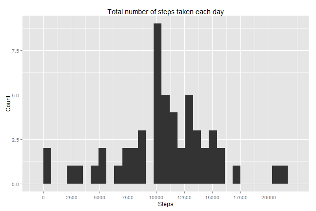
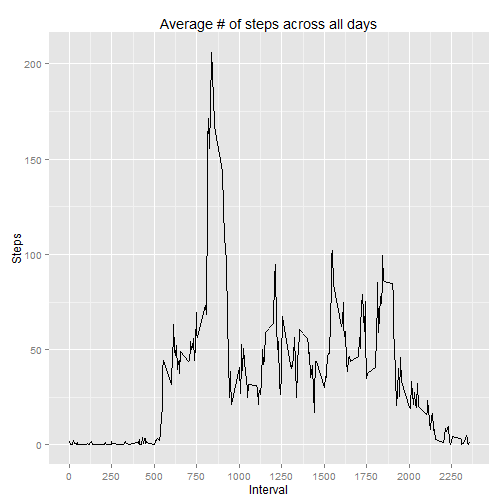
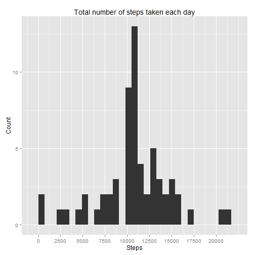

Coursera Reproducible Research Peer Assessment 1
========================================================

# Reproducible Research: Peer Assessment 1

## Loading and preprocessing the data

### Load the data

```r
activity = read.csv("activity.csv")
library(ggplot2)
```

### Process/transform the data into a format suitable for your analysis


## What is mean total number of steps taken per day?

### Histogram of the total number of steps taken each day

```r
stepsByDay <- aggregate(steps ~ date, activity, sum)
ggplot(stepsByDay, aes(x=steps)) + 
  geom_histogram(binwidth=700) + 
  xlab("Steps") + 
  ylab("Count") + 
  ggtitle("Total number of steps taken each day") + 
  scale_x_continuous(breaks=seq(0,22000,2500))
```

 

### Calculate and report the mean and median total number of steps taken per day

```r
mean(stepsByDay$steps, na.rm=T)
```

```
## [1] 10766
```

```r
median(stepsByDay$steps, na.rm=T)
```

```
## [1] 10765
```

## What is the average daily activity pattern?

### Make a time series plot of the 5-minute interval (x-axis) and the average number of steps taken, averaged across all days (y-axis)

```r
stepsByInterval <- aggregate(steps ~ interval, 
                             activity, 
                             mean)
ggplot(stepsByInterval, aes(x=interval, y = steps)) + 
  geom_line(type="1") + 
  xlab("Interval") + 
  ylab("Steps") + 
  ggtitle("Average # of steps across all days") + 
  scale_x_continuous(breaks=seq(0,3000,250))
```

 

### Which 5-minute interval, on average across all the days in the dataset, contains the maximum number of steps?

```r
stepsByInterval[which.max(stepsByInterval$steps), 1]
```

```
## [1] 835
```
835 time interval has the maximum number of steps

## Imputing missing values

### Calculate and report the total number of missing values in the dataset (i.e. the total number of rows with NA's)

```r
nrow(subset(activity, is.na(steps)))
```

```
## [1] 2304
```
There are 2304 missing values in the dataset

### Devise a strategy for filling in all of the missing values in the dataset.

I used the code from stackoverflow <a href="http://stackoverflow.com/questions/9322773/how-to-replace-na-with-mean-by-subset-in-r-impute-with-plyr/9322975#9322975">How to replace NA with mean by subset in R (impute with plyr?)</a>, using plyr package.


```r
library(plyr)

impute.mean <- function(x) replace(x, is.na(x), mean(x, na.rm = TRUE))
```

### Create a new dataset that is equal to the original dataset but with the missing data filled in

```r
# create a new dataset that is equal to the original dataset, but with the missing data
# filled in, original data set is first three variables of the [activity] dataframe
activity.imputed <- plyr::ddply(activity[1:3], 
                                .(interval), 
                                transform,
                                steps = impute.mean(steps),
                                date = date,
                                interval = interval)

# sort by date and interval
activity.imputed <- activity.imputed[order(activity.imputed$date, activity.imputed$interval), ]

# renumber rownames
row.names(activity.imputed) <- 1:nrow(activity.imputed)
```

### Make a histogram of the total number of steps taken each day and calculate and report the mean and median total number of steps taken per day.

```r
stepsByDay.imputed <- aggregate(steps ~ date, activity.imputed, sum)
ggplot(stepsByDay.imputed, aes(x=steps)) + 
  geom_histogram(binwidth = 700) + 
  xlab("Steps") + 
  ylab("Count") + 
  ggtitle("Total number of steps taken each day") + 
  scale_x_continuous(breaks=seq(0,22000,2500))
```

 

```r
mean(stepsByDay.imputed$steps)
```

```
## [1] 10766
```

```r
median(stepsByDay.imputed$steps)
```

```
## [1] 10766
```

Mean of the imputed data has shifted by 0 steps and median has shifted by 1.1887 steps.  Total number of steps of the collected data has gone up 86129.509434 steps from 570608 steps to imputed 656737.509434 steps.  Since I imputed the missing steps with mean steps for each interval, mean of steps for interval has not changed, but the total number of steps for the collected data has increased.

## Are there differences in activity patterns between weekdays and weekends?

### Create a new factor variable in the dataset with two levels - "weekday" and "weekend" indicating whether a given date is a weekday or weekend day

```r
activity.imputed$day <- factor(!(weekdays(as.Date(activity.imputed$date)) %in% c("Saturday", "Sunday")), 
                               labels = c("weekend", "weekday"))
```

### Make a panel plot containing a time series plot of the 5-minute (x-axis) and the average number of steps taken, averages across all weekday days or weekend days (y-axis).

```r
stepsByInterval.imputed <- aggregate(steps ~ interval + day, activity.imputed, mean)
ggplot(stepsByInterval.imputed, aes(x=interval, y = steps)) + 
  geom_line(type="1") + 
  xlab("Interval") + 
  ylab("Number of steps") + 
  facet_wrap(~ day, ncol = 1) + 
  scale_x_continuous(breaks=seq(0,3000,250))
```

 

There is a difference in activity patterns between weekdays and weekends, during week day the data shows that there are more steps for earlier intervals than week ends, which corellates to person being active earlier in the day during week days than week ends.
